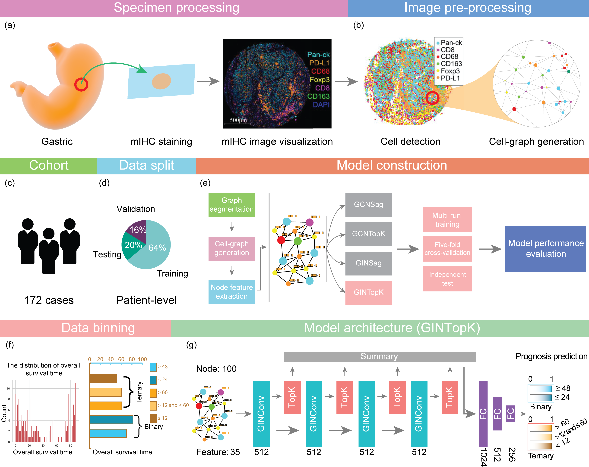

# Cell-Graph Signature (CGSignature)
#### GNN-based cancer prognosis prediction using image-derived Cell-Graphs
> Git repo for the manuscript of "Cell graph neural networks enable digital staging of tumour microenvironment and precisely predict patient survival in gastric cancer".

### Abstract
Gastric cancer is one of the deadliest cancers worldwide. Accurate prognosis is essential for effective clinical assessment and treatment. Spatial patterns in the tumor microenvironment (TME) are conceptually indicative of the staging and progression of gastric cancer patients. Using spatial patterns of the TME by integrating and transforming the multiplexed immunohistochemistry (mIHC) images as Cell-Graphs, we propose a novel graph neural network-based approach, termed **Cell-Graph Signature** or **CGSignature**, powered by artificial intelligence, for digital staging of TME and precise prediction of patient survival in gastric cancer. In this study, patient survival prediction is formulated as either a binary (**short-term** and **long-term**) or ternary (**short-term**, **medium-term**, and **long-term**) classification task. Extensive benchmarking experiments demonstrate that the CGSignature achieves outstanding model performance, with Area Under the Receiver-Operating Characteristic curve (AUROC) of 0.960 &pm; 0.01, and 0.771 &pm; 0.024 to 0.904 &pm; 0.012 for the binary- and ternary-classification, respectively. Moreover, Kaplan-Meier survival analysis indicates that the 'digital-grade' cancer staging produced by CGSignature provides a remarkable capability in discriminating both binary and ternary classes with statistical significance (<em>P-value</em> < 0.0001), significantly outperforming the AJCC 8th edition Tumor-Node-Metastasis staging system. Using Cell-Graphs extracted from mIHC images, CGSignature improves the assessment of the link between the TME spatial patterns and patient prognosis. Our study suggests the feasibility and benefits of such artificial intelligence-powered digital staging system in diagnostic pathology and precision oncology.

### Workflow

**Figure 1. An overall workflow of graph neural network-based prognosis prediction using Cell-Graphs.**
**(a)** Specimen processing: The tumor tissues were extracted from gastric cancer, and stained with seven different biomarkers including DAPI, Pan-CK, CD8, CD68, CD163/CD45, Foxp3, and PD-L1. **(b)** Image pre-processing: sub-sampling and cell-graph construction were conducted for image pre-processing. **(c)** An illustration for the cohort, 172 gastric cancer patients were collected. **(d)** Data split. The training, validation and testing datasets were split with the percentages of 64%, 16%, and 20%, respectively. **(f)** Data binning: overall survival time ranged from 0 to 88 months, and two data binning strategies were applied to generate  binary- and ternary-class datasets. **(e)** Model construction: four different GNN model architectures, including GCNSag, GCNTopK, GINSag, and GINTopK, were constructed and compared. Multi-run model training, five-fold cross-validation, and independent test were conducted to evaluate the performance of the constructed GNN models. **(g)** Model architecture: The four models shared the same architecture but employed different types of convolutional unit and pooling layer, which consists of four consecutive convolutional layer and pooling layer blocks, followed by a summary layer and three fully-connected layers, prior to the generation of the final classification outcome. Architecture of the best-performing GINTopK model is illustrated herein, which outperformed the other three model architectures and also achieved the best performance on the test dataset. The corresponding number of hidden layers or feature dimensions are indicated at the bottom of each box. Here, FC stands for "fully connected layer".

**Figure 2. An overview of procedures from multiplexed staining to Cell-Graph generation.** Detailed information can be seen in the descriptions of the figure.
